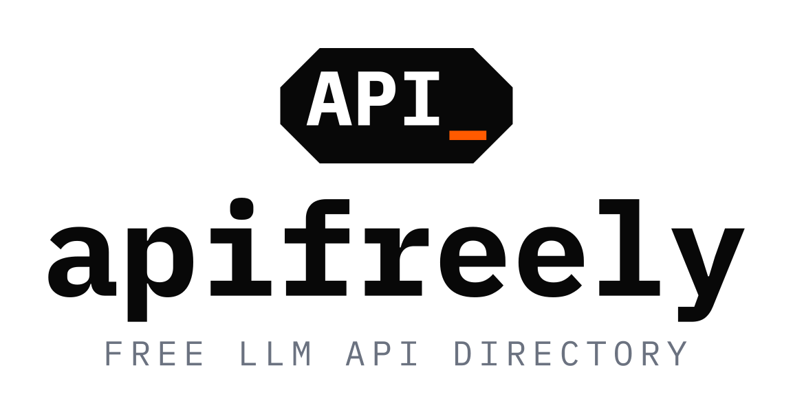

<div align="center">

<picture>
  <source media="(prefers-color-scheme: dark)" srcset="public/logo-full-dark.svg">
  
</picture>

### Free LLM APIs, ready in 30 seconds.

A free &amp; open directory of LLM APIs — find a working free tier, get copy‑paste
setup for your agent, and let it configure itself.
**We never see your keys.**

<br>


</div>

---

## Why apifreely

Free LLM API access is everywhere — Groq, Gemini, GLM, DeepSeek, Qwen, OpenRouter,
plus a constant stream of credit promos. But the info is scattered across docs and X
threads, goes stale fast, and never tells you **how to actually plug it into your tools**.

apifreely fixes that:

1. **Find** a free / free‑tier provider that's still alive.
2. **Generate** the exact config for your agent — or a prompt your agent runs to set itself up.
3. **Paste your own key** into your own environment. The site never stores or sees it.

## Features

| | |
|---|---|
| 🗂️ **20 providers** | OpenAI‑compatible & native endpoints, filterable by access type, status & credit‑card |
| 🤖 **10 agent targets** | Claude Code, Cline, Cursor, Roo, Continue, Windsurf, Aider, Hermes, OpenClaw, LibreChat |
| ⚡ **Prompt generator** | Pick provider + agent → a paste‑to‑agent prompt with model/temp/token tuning |
| 📋 **Per‑provider setup** | Tabbed detail: Quick Setup, models, endpoints, multi‑language examples (curl/Python/Node/TS), FAQ |
| 📚 **Setup guides** | Agent‑first guides — connect any free provider to your favourite tool |
| 🔌 **Live status** | Health overview + community tip feed for promo drops |
| 🔒 **Zero key storage** | Everything runs in your browser; the generator never transmits your key |
| 🎨 **Production polish** | Real brand logos, dynamic OG image, sitemap/robots, PWA manifest, motion (reduced‑motion safe) |

## Pages

| Route | Description |
|---|---|
| `/` | Landing — hero, live stats, popular providers |
| `/providers` | Browse directory — search, filters, grid/list, pagination |
| `/providers/[id]` | Provider detail — Quick Setup, tabs, multi‑language examples |
| `/setup-guides` · `/setup-guides/[agent]` | Agent‑first setup guides |
| `/generator` | Prompt generator + manual config + customization |
| `/status` | Provider health overview |
| `/community` | Community‑sourced free tiers & promos |
| `/submit` | Submit a free API to the moderation queue |

## Providers included

**Free tier** — Groq · Google AI Studio (Gemini) · OpenRouter · Mistral · GitHub Models ·
Cloudflare Workers AI · Cerebras · SambaNova · Zhipu GLM (incl. GLM‑5.2) · Qwen · SiliconFlow

**Trial / credits** — Cohere · Together AI · DeepSeek · Moonshot (Kimi K2)

**Promo (community, time‑limited)** — Inferall · Sauna AI · Aerolink · Junior · ZenMux

> Endpoints are verified; promo entries are community‑sourced — always check before relying on one.

## Tech stack

Next.js 16 (App Router) · React 19 · TypeScript · Tailwind v4 · Framer Motion.
Real brand logos are official SVG paths ([`components/brand-icons.ts`](components/brand-icons.ts))
plus the hand‑built `API_` mark. Provider data lives in
[`data/providers.ts`](data/providers.ts); setup snippets/prompts are generated in
[`lib/`](lib/).

## Run locally

```bash
npm install
npm run dev      # http://localhost:3000
npm run build    # production build (typecheck + lint)
npm start        # serve the build
```

## Deploy

Static‑first — deploy to Vercel (or any Node host) with zero config. Environment
variables are **all optional**:

| Var | Purpose |
|---|---|
| `NEXT_PUBLIC_SITE_URL` | Canonical URL for metadata / sitemap / robots |
| `SUBMIT_WEBHOOK_URL` | Forward `/submit` entries to a webhook (Discord/Slack/Zapier) |

## Contributing

Spotted a free API or promo we're missing? Open the [`/submit`](app/submit) page, or add an
entry to [`data/providers.ts`](data/providers.ts). For a real brand logo, drop the
[Simple Icons](https://simpleicons.org) slug into `components/brand-icons.ts`.

See [`Product.md`](Product.md) for the full concept, data‑sourcing policy, and abuse rules.

## License

[MIT](LICENSE) — built by Trace Collective.
